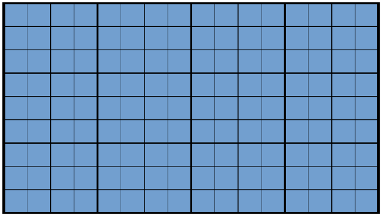

## The region map should indicate the state of the world

The region map generalizes information for the DM across the known world.
This should make it *easy* and *fast* to reflect player actions across the world.
Each hex tile takes players half a day to cross, or half that time with a suitable pathway (road, water) and mount (steed, boat).
The region map is intended as a tool for the Dungeon Master, though it could be shown to players partially or in full to help communicate options or changes to the game world.

## Map Generation

Prepare a hex map in _non-erasable ink_.
The hex map should be *no bigger than required* to host the first game session.
Each hex should have a label in the bottom left (in _non-erasable ink_) which serves as a coordinate.
Use a centroid coordinate notation, where 0A is the center hex, 1A-1F is the surrounding 6 hex tiles, and 2A-2L is the surrounding 12 hex tiles, and so on.
See @fig:hex-on-square-grid for an example, where it is also shown how to make a hex grid out of a standard square grid.

If you are starting with a new campaign, it is recommended to start in a Small Sandbox (r=3).

|Session Type|Radius|Tile Count|
| ---:|:---:|:---:|
|One Shot|2|19|
|Small Sandbox|3|37|
|Medium Sandbox|5|91|
|Large Sandbox|7|169|
|Massive Sandbox|9|271|
: Region Map Size {#tbl:region-map-size}

{#fig:hex-on-square-grid}

Everything else in this map is liable to change over time; _use pencil_ so it can be erased.
Start by charting waterways as shown in @fig:water-tiles to show the path of rivers between lakes and seas.

(#fig:water-tiles)

Next, choose biomes from @fig:land-tiles for all hex tiles.

(#fig:land-tiles)

Then, place structures from @fig:structure-tiles about the map.

(#fig:structure-tiles)

Mark impasses between hex tiles, where players would have to succeed a skill challenge to pass.
Notate Points Of Interest (POI), where players would encounter a scripted event by traveling there.
Finally, mark some hex tiles that have been consecrated and desecrated.

(#fig:event-tiles)

